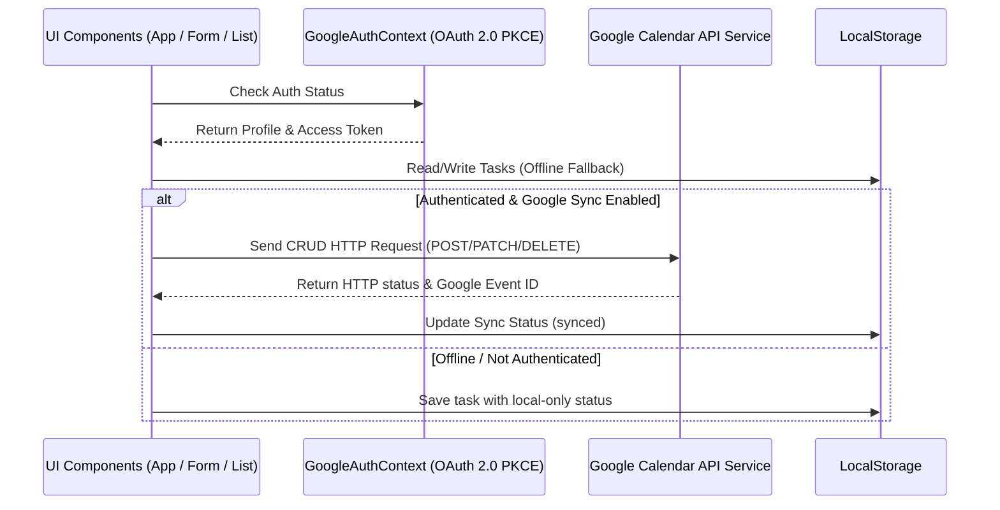

# Smart To-Do

Клієнтський додаток для планування завдань з двосторонньою синхронізацією подій з сервісом Google Calendar. Додаток розроблено як Static Web Application (SPA), що працює повністю на стороні клієнта без власного бекенд-сервера.

## Технологічний стек

*   **Фреймворк**: React 19.2.7 (React DOM 19.2.7)
*   **Складальник проекту**: Vite 8.1.1 (з плагіном `@vitejs/plugin-react` v6.0.3)
*   **Стилізація**: Vanilla CSS (CSS Variables)
*   **Бібліотека іконок**: Lucide React 1.23.0
*   **Аналізатор коду (Linter)**: Oxlint 1.71.0
*   **Протокол авторизації**: OAuth 2.0 PKCE (Proof Key for Code Exchange)
*   **Базове сховище даних**: Web Storage API (localStorage)

## Архітектура

Проект побудовано за тришаровою клієнтською архітектурою:

1.  **Presentation Layer (Шар відображення)**:
    *   `src/App.jsx` — центральний вузол додатку, що координує взаємодію інтерфейсу з бізнес-логікою та локальним сховищем.
    *   `src/components/TaskForm.jsx` — інтерфейс додавання та редагування завдань з вбудованою валідацією полів.
    *   `src/components/TaskList.jsx` — інтерфейс виведення списку завдань із підтримкою фільтрації (Всі, Активні, Виконані).
2.  **Business Logic Layer (Шар бізнес-логіки)**:
    *   `src/context/GoogleAuthContext.jsx` — React Context Provider, який управляє станом авторизації користувача, обміном кодів на токени, перевіркою валідності сесії та механізмом оновлення Access Token (Silent Refresh).
3.  **Data Access Layer (Шар доступу до даних)**:
    *   `src/services/googleCalendar.js` — сервісний модуль для взаємодії з REST API Google Calendar за допомогою асинхронних HTTP-запитів.
    *   `src/utils/pkce.js` — утиліти для забезпечення безпеки авторизації (генерація SHA-256 Code Challenge, Code Verifier та випадкових станів CSRF-валідації через Web Crypto API).

### Патерни та підходи

*   **React Context Pattern**: використовується для глобального доступу до стану авторизації та облікових даних клієнта (`useGoogleAuth`) без необхідності прокидання пропсів через проміжні компоненти (prop drilling).
*   **Service Pattern**: виділення мережевих запитів до Google Calendar API в окремий модуль `googleCalendar.js` для ізоляції логіки роботи з зовнішньою системою.
*   **State Machine (Синхронізація)**: стан кожної задачі описується властивостями статусу синхронізації (`local`, `syncing`, `synced`, `failed`), що дозволяє обробляти помилки мережі та проводити повторну пакетну синхронізацію.

### Схема взаємодії компонентів



### Технічні рішення та Trade-offs

*   **Безсерверний OAuth PKCE**: Оскільки додаток є статичним клієнтським додатком, автентифікація реалізована за стандартом PKCE. Це виключає потребу у виділеному сервері для обміну кодів авторизації. Зберігання `Client ID` та `Client Secret` реалізовано через змінні оточення Vite (`import.meta.env`) з можливістю динамічного введення користувачем в UI (зберігаються в `localStorage`).
*   **Локальна стійкість (Offline-first)**: Додаток зберігає всі дані локально. При відновленні з'єднання або після авторизації користувач може синхронізувати локально створені завдання з Google Calendar.

## Функціонал

*   **Управління завданнями (CRUD)**: створення, читання, оновлення статусу виконання, повне видалення завдань.
*   **Синхронізація подій**:
    *   Створення події у Google Calendar при додаванні завдання в додатку.
    *   Автоматична зміна назви події (додавання префіксу `✓`) у календарі при позначенні завдання як виконаного.
    *   Видалення події з календаря при видаленні завдання в додатку.
*   **Автентифікація Google**: безпечний вхід через спливаюче вікно (popup), автоматичне оновлення токенів без переривання роботи користувача (Token Refresh Flow).
*   **Локальний бекап**: збереження невивантажених завдань при проблемах з інтернет-з'єднанням.

## Встановлення та запуск

### Вимоги до оточення

*   Node.js (рекомендовано v20 або вище)
*   npm (або yarn)

### Налаштування змінних середовища

Для роботи автоматичної підстановки ключів Google API створіть файл `.env` в кореневому каталозі проекту:

```env
VITE_GOOGLE_CLIENT_ID=your_google_client_id
VITE_GOOGLE_CLIENT_SECRET=your_google_client_secret
```

### Запуск додатку

1.  Встановіть залежності:
    ```bash
    npm install
    ```
2.  Запустіть локальний сервер розробки:
    ```bash
    npm run dev
    ```
    *Проект буде запущений на http://127.0.0.1:3000.*

3.  Збірка для виробничого середовища:
    ```bash
    npm run build
    ```

## Тестування

Автоматизоване тестування (unit- чи integration-тести) у поточному репозиторії відсутнє. [TODO: уточнити]

## Обмеження та відомі недоліки

*   **Залежність від середовища браузера**: Використання об'єктів `window.localStorage` та `window.sessionStorage` обмежує сумісність з Server-Side Rendering (SSR) технологіями без додаткових перевірок.
*   **Відсутність мультидевайсної синхронізації**: Завдання, які не були синхронізовані з Google Calendar, існують виключно в межах локального сховища поточного браузера на конкретному пристрої.
*   **Безпека Client Secret на клієнті**: Незважаючи на використання PKCE, для типу клієнта "Web application" Google вимагає передачу `client_secret`. Передача та зберігання секрету на клієнті є компромісом безпеки для забезпечення безсерверної архітектури.
